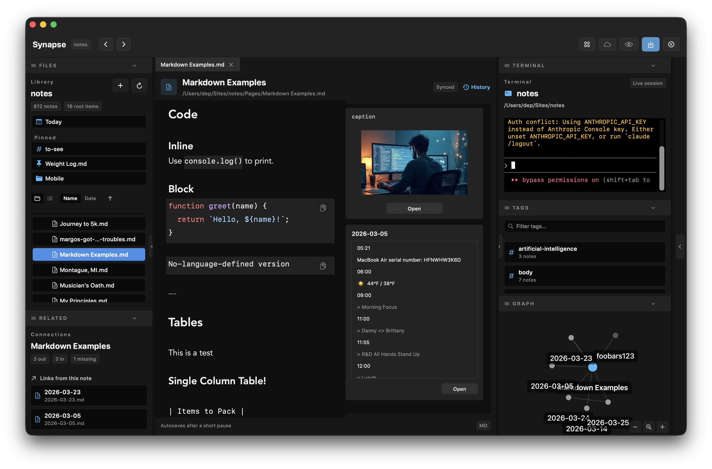
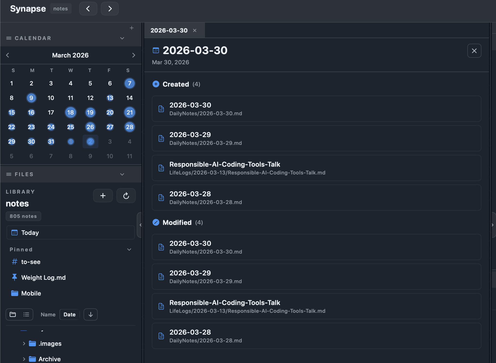
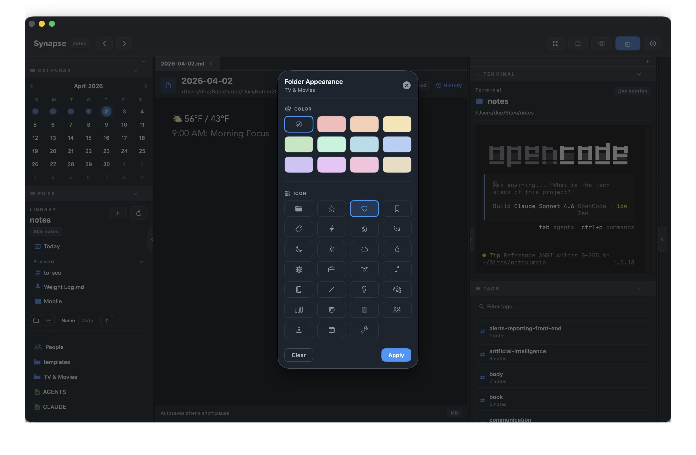
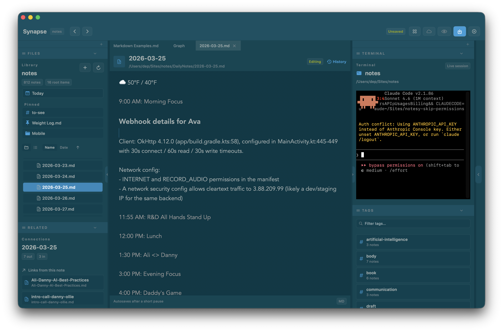

# Welcome to Synapse!



Synapse is a powerful Markdown-based knowledge management application exclusively built for macOS using SwiftUI. It's your second brain, backed by YOUR Git repository, and is deeply customizable.

♥️ Built by nerds _for_ nerds.

## Setup & Installation

1. **Download the App:** [Download the latest release (DMG) of Synapse](https://github.com/dep/synapse/releases).
2. **Installation:**
   Drag the Synapse application to your `Applications` folder.
3. **Open a Vault:**
   Upon launching Synapse, you'll be prompted to select a folder. This folder acts as your **Vault**, where all your Markdown notes and assets are stored locally.

### Initial Configuration

Once your vault is opened, consider configuring the following:
- **Git Sync:** Navigate to `Settings > Auto-save` to ensure your vault is backed up or synced with a remote Git repository.
- **Terminal Integration:** If you use the built-in terminal, set your preferred "On-boot command" in the Settings.

## Features



Synapse packs a robust set of features to boost your productivity.

### Markdown Editor
- **Live Styling:** Write in plain text, but see bold, italics, links, and code blocks styled live.
- **Preview Mode:** Toggle a clean rendered view that hides markdown syntax (`⌘⇧P`). The eye icon in the toolbar activates it.
- **Hide Markdown While Editing:** Enable in Settings → Editor to keep syntax hidden as you type — a distraction-free writing mode with real-time rendering.
- **Slash Commands:** Type `/time`, `/date`, `/todo`, or `/note` at the start of a line or after a space — expands instantly as you type.
- **Wikilinks:** Easily link to other notes using `[[Note Name]]`, or highlight text and press `CMD + K` to turn it into a wikilink with that text as the display alias.
- **Embedded Notes:** Include other notes directly using `![[Note Name]]`.
- **Media Previews:** Inline support for image rendering and YouTube video previews.
- **Paste HTML as Markdown:** Copy content from any website and paste it directly into Synapse — it's automatically converted to clean Markdown.
- **View History:** Access the View History button in the file editor to see previous versions of your note.



### Navigation
- **Tabs:** Cycle through your most recently used (MRU) tabs seamlessly.
- **Split Panes:** Work efficiently by splitting your editor vertically or horizontally.
- **Command Palette:** Quickly find files, folders, tags, or insert templates from anywhere.
  - **Quick Actions:** Type `Root` to jump to your vault root, or `Today` to open today's daily note.
  - **Folder Search:** Type any folder name to navigate directly to it.
  - **Tag Search:** Type `#tagname` to search for and filter notes by tag.


### Graph View
Visualize connections between your notes.
- **Local Graph:** See a 1-hop view of links related to your current note in the sidebar.
- **Global Graph:** A comprehensive, force-directed graph of your entire vault.

### Git Integration
- **Auto-Sync:** Optionally enable automatic commit, push, and pull functionality.
- **Conflict Handling:** Git conflicts are managed cleanly within the interface.

### Daily Notes & Templates
- **Daily Notes:** Start each day with a fresh note created automatically using customizable templates.
- **Templates:** Use templates for dynamic note creation with variables like <code v-pre>{{year}}</code>, <code v-pre>{{month}}</code>, <code v-pre>{{day}}</code>, and <code v-pre>{{cursor}}</code> (where the cursor lands after template insertion).
- **New Note with Folder Picker:** When creating a new note (via `CMD+N` or the + button), a folder picker lets you choose exactly where to save it. Synapse remembers your last used folder per vault and pre-selects it for subsequent notes. Right-click any folder in the file tree and select "New Note" to pre-select that specific folder.

### Pinning
Pin frequently used notes, folders, and tags for quick access directly from the sidebar.
- **Right-click** any file or folder in the file tree and select **Pin**
- **Right-click** any tag in the Tags pane and select **Pin**
- Pinned items appear in a **Pinned** section above the file tree
- Click a pinned note to open it; `Cmd+click` opens it in a new tab
- Click a pinned folder to expand and scroll to it in the file tree
- Click a pinned tag to open a filtered view of that tag in a new tab
- Pins are vault-specific and persist across app restarts

### Extensible Sidebar
Customize left and right sidebars with panes:
- **Files:** A file tree view.
- **Tags:** See all tags used across your vault.
- **Terminal:** An integrated ZSH terminal inside the app.
- **Related Links:** See what files link to the current one.
- **Graph:** The local vault graph.

Drag and drop files directly to sidebar panes to move or organize your notes.

### Gist Publishing
Easily publish specific notes to GitHub Gists using your Personal Access Token (PAT).

### .gitignore Support
Synapse can automatically hide files and folders that your project's `.gitignore` rules mark as ignored — so `node_modules/`, `build/`, and other generated directories stay out of your file tree without any extra configuration.
- Enable or disable this in **Settings → File Browser → Respect .gitignore** (on by default).
- Nested `.gitignore` files and global git ignores are honoured automatically.
- Non-git vaults are unaffected — scanning works normally.

### Themes

Synapse has full theme support, with the ability to use one of our existing dark/light themes or create your own!



### Vault-Specific Settings
Settings automatically sync with your vault. When you open a vault, Synapse stores its settings in `.synapse/settings.yml` at the vault root:
- **Portable Settings** — Settings travel with the vault, perfect for syncing via Git or cloud storage
- **Vault Independence** — Each vault has its own independent settings
- **Visible & Controllable** — The `.synapse` folder appears in your file tree; you control whether to commit it
- **Privacy Protected** — Your GitHub Personal Access Token stays local in `~/Library/Application Support/Synapse/settings.yml` and never leaves your machine

## Settings

To access Synapse settings, press `CMD + ,` or navigate to `Synapse > Settings` in the menu bar.

### General
- **On-boot terminal command:** Set a command that runs automatically when the Terminal pane is loaded (e.g., loading an environment, starting Claude Code, etc).
- **File extension filters:** Define which file extensions are visible in your vault's File Tree.

### Workflows
- **Daily Notes:**
  - Enable/disable auto-creation.
  - Set the default folder for daily notes.
  - Choose a template for daily notes.
- **Templates Directory:** Define the folder containing your note templates.

### Sync
- **Auto-save:** Enable automatic saving of changes.
- **Auto-push (Git):** If your vault is a Git repository, Synapse can automatically commit and push changes on a set interval.
- **GitHub PAT:** Provide a GitHub Personal Access Token to enable publishing notes as Gists.

### Sidebar Layout
Fully customize your workspace by managing panes in the left and right sidebars.
Available panes:
- Files
- Tags
- Related
- Terminal
- Graph

## Keyboard Shortcuts

Synapse relies heavily on keyboard shortcuts to help you navigate and edit quickly.

### File & Note Management
| Action | Shortcut |
| --- | --- |
| New Note | `CMD + N` |
| New Untitled Note | `CMD + T` |
| Close Vault / Exit | `CMD + SHIFT + N` |
| Save | `CMD + S` |
| Reload (Pull & Refresh) | `CMD + R` |
| Command Palette | `CMD + K` or `CMD + P` (`CMD + K` on selected text opens the wiki link picker) |

### Search
| Action | Shortcut |
| --- | --- |
| Find in Note | `CMD + F` |
| Global Search | `CMD + SHIFT + F` |
| Find Next | `CMD + G` |
| Find Previous | `CMD + SHIFT + G` |

### Navigation & Tabs
| Action | Shortcut |
| --- | --- |
| Close Tab | `CMD + W` |
| Close Other Tabs | `CMD + SHIFT + W` |
| Reopen Closed Tab | `CMD + SHIFT + T` |
| Switch to Tab (1-8) | `CMD + 1` to `CMD + 8` |
| Switch to Last Tab | `CMD + 9` |
| Go Back (History) | `CMD + [` |
| Go Forward (History) | `CMD + ]` |
| Cycle MRU Tabs | `CTRL + TAB` |

### Split Panes
| Action | Shortcut |
| --- | --- |
| Split Vertical | `CMD + D` |
| Split Horizontal | `CMD + SHIFT + D` |
| Switch Panes | `CMD + OPT + Arrows` |

### Other
| Action | Shortcut |
| --- | --- |
| Open Global Graph | `CMD + SHIFT + G` |
| Open Today's Note | `CTRL + CMD + H` |
| Toggle Preview Mode | `CMD + SHIFT + P` |
| Toggle Hide Markdown While Editing | `CMD + E` |

## Context-Aware Assistance

Synapse provides context-aware assistance by creating a `.synapse/state.json` file at the start of relevant interactions. This file contains information about the current note the user is viewing, including the vault-relative path to the note, the list of open tabs, and the last updated timestamp.

This enables context-aware assistance where "this note" refers to the active file.  So if you are using an AI Agent inside of your Notes vault, **it's recommended that you add the following instructions to your agent configuration** (into your root `AGENTS.md` file):

````
### Current Note Context

<critical_info>
This allows the user to reference the current note or notes they are viewing in the Notes vault.

eg., "What is the current note?"
</critical_info>

When operating in a Synapse vault directory, read `.synapse/state.json` at the start of relevant interactions to understand which note the user is currently viewing. This enables context-aware assistance where "this note" refers to the active file.

**State file format:**
- `currentFile` — Vault-relative path to the currently focused markdown file (null if graph/tag view is active)
- `openTabs` — Array of vault-relative paths for all open note tabs
- `lastUpdated` — ISO 8601 timestamp of when the state was last written

**Guidelines:**
- Check this file when the user refers to "this note" or when context about the active file would be helpful
- Use vault-relative paths from this file when working with notes
- The file is transient runtime state and may not exist if Synapse is not running
````

## Support the Developer

If Synapse saves you money on a notes app subscription or just sparks a little joy, a coffee goes a long way. ☕

[](https://buymeacoffee.com/dnnypck)

## Additional Documentation

- [Markdown Guide and More Tips & Tricks](./markdown.md)
- [Support](./support.md) — contact, GitHub issues, and feedback
- [Privacy Policy](./privacy-policy.md)
- [Terms of Service](./terms-of-service.md)
